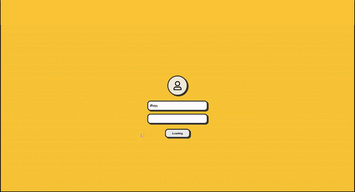

# Copy of a cool Portfolio website

The design for for me to get better with react. 

## Table of contents

- [Technologies](#technologies)
- [Languages](#languages)
- [Features](#features)<!-- - [Status](#status) -->
- [For future development](#features-for-future-development)
- [Inspiration](#inspiration)
- [Contact](#contact)

## Technologies, Modules and Tools

- React
- Node.js / Express
- JavaScript
- Github Actions
- Styled Components

## Languages

- JavaScript

## Features

Users can:

- View my projects and information.
- Experience a computer themed portfolio.

## Features for future development

- Fix the few little UI mistakes here and there.
- Add a better theme system.
- Add more components
- Make main apps work

## Contact

Created by [@princeVillamil](https://twitter.com/reactJaMo) - was inspired by @RussellCarey 